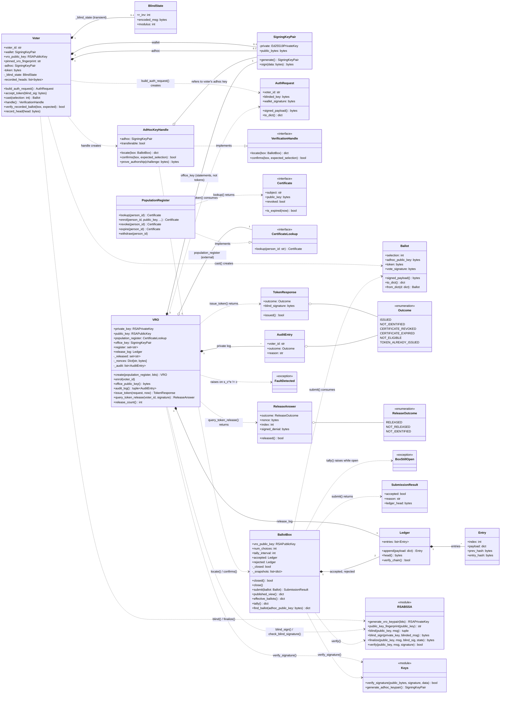
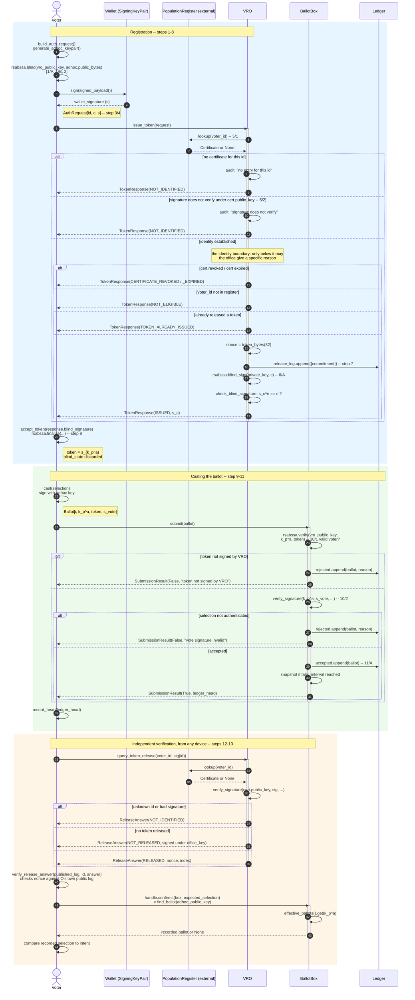

# System Architecture: Class and Sequence Diagrams

**Scope.** This document gives a code-level view of the package structure and
the protocol's runtime flow, as a companion to the specifications in
`docs/blind-signature.md` and `docs/protocol.md`. Where the technical article
(*Proposal for a Secure, Private, and Coercion-Resistant Online Voting
System*) numbers protocol steps (1/A, 5/1, 10/2, etc.), the sequence diagram
below cross-references the same numbers so the two documents can be read
side by side.

Both diagrams are derived directly from `src/ovpoc/*.py` as of the commit
that introduced this file. If the modules change, regenerate rather than
hand-edit -- the class diagram in particular is easy to let drift from the
actual field and method names.

**Two registers, two parties.** `PopulationRegister` is not part of the system:
it stands in for national identity infrastructure and lives in `driver/`,
outside the library, because the design consults it rather than builds it
(article §3.2). The library declares only the shape it needs, as the
`Certificate` and `CertificateLookup` protocols. The *electoral* register is
`VRO.register` -- a set of identifiers, and nothing else.

---

## 1. Class diagram

---

## 2. Sequence diagram

Step numbers in the notes (`step 3/4`, `10/1`, `12`, etc.) match the
numbering in the technical article and in `figures/Online_Voting_PIC.pdf`.

